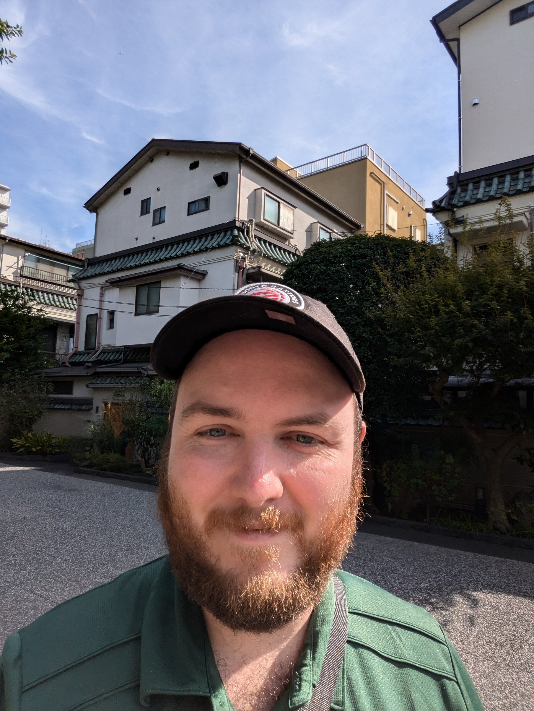

[Find my projects here](./ProjectsPage.HTML).


# Hardware Experience

Desktop building and support utilizing Windows, MacOS, and Linux systems.

## Software Experience

> VMWare - 1 year
> 
> Microsoft Office - 10 years
> 
> VScode - 1 year
> 
> GitHub - 1 year
> 
> Learning isn't something you finish, it is something you do.

### Certification & Compentencies

Comptia A+ certification 
<div data-iframe-width="150" data-iframe-height="270" data-share-badge-id="e1e19dff-baef-48f2-ac79-75806402a9a7" data-share-badge-host="https://www.credly.com"></div><script type="text/javascript" async src="//cdn.credly.com/assets/utilities/embed.js"></script>
Cisco Competencies
<div data-iframe-width="150" data-iframe-height="270" data-share-badge-id="2743a529-4059-41ee-b994-41f22b85c424" data-share-badge-host="https://www.credly.com"></div><script type="text/javascript" async src="//cdn.credly.com/assets/utilities/embed.js"></script>
<div data-iframe-width="150" data-iframe-height="270" data-share-badge-id="afc6e374-64dc-429f-b866-6a01141ef29a" data-share-badge-host="https://www.credly.com"></div><script type="text/javascript" async src="//cdn.credly.com/assets/utilities/embed.js"></script>
<div data-iframe-width="150" data-iframe-height="270" data-share-badge-id="0fb05b84-75ac-4185-9f90-4b57e3d1a9da" data-share-badge-host="https://www.credly.com"></div><script type="text/javascript" async src="//cdn.credly.com/assets/utilities/embed.js"></script>


```ruby
The next step is always the most important.
```

#### Languages

*   Python - 1 year
*   HTML - 1 year


* * *


### Small image

 


```

```

```

```
